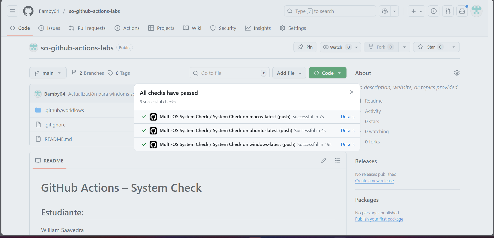

# GitHub Actions – System Check

## Estudiante:

William Saavedra

## Descripción

Este workflow ejecuta una verificación básica del sistema en tres plataformas:

- Ubuntu
- Windows
- macOS

## Evidencia de los check aprobado

